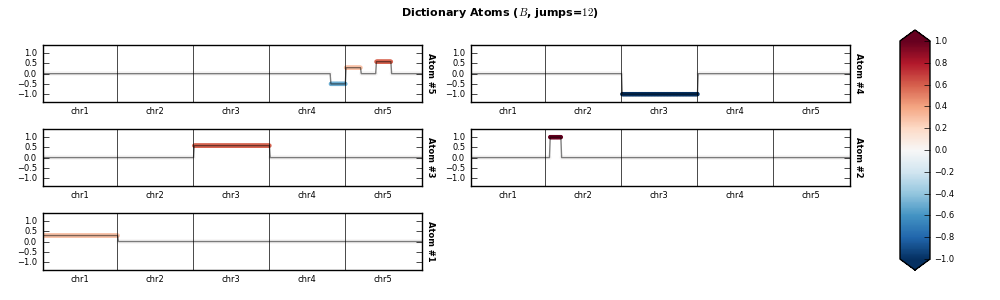
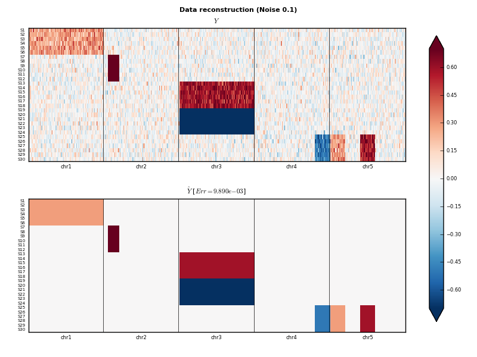

eFLLAT
------

Copy number variations (CNVs) are alterations of the DNA that result in the cell having an abnormal number of copies of one or more sections of the DNA. Recurrent aberrations across samples may indicate an oncogene or a tumor suppressor gene, but the functional mechanisms that link altered copy numbers to pathogenesis are still to be explained. Array-based Comparative Genomic Hybridization (aCGH) is a modern whole-genome measuring technique that evaluates the occurrence of copy variants across the genome of samples (patients) versus references (controls) on the entire genome, extending the original CGH technology.

.. figure:: images/cgh_alterations.png
    :scale: 50 %

    An example of an aCGH presenting several alterations: deletions are visible on chromosomes 10 and 14, duplications on chromosomes 12 and 17.

A signal measured with an aCGH is made of a piecewise linear (and constant) component plus some noise. The typical analysis on such data is segmentation, that is the automatic detection of altered copy numbers (amplifications or deletions). Differently from other molecular data, as gene expression, with aCGH it is possible to exploit the intrinsic data structure to improve the downstream analysis.

The algorithm uses a Dictionary Learning (DL) approach to identify common structures in the aCGH samples, i.e. locations where alterations (deletions or duplications) are significantly more frequent than in the rest of the genome by minimizing functional

.. math::

    {\bm B}, {\bm \Theta} = \argmin \| {\bm Y} - {\bm B} {\bm \Theta} \|_F^2 + \tau \sum_{s=1}^S \| {\bm \Theta}(:,s) \|_1^2 + \lambda \sum_{j=1}^J \| {\bm B}(:, j) \|_1^2 + \mu \sum_{j=1}^J TV_w ({\bm B}(:, j))

* Term :math:`\| {\bm Y} - {\bm B} {\bm \Theta} \|_F^2` minimizes the reconstruction error.
* Term :math:`\tau \sum \limits_{s=1}^S \| {\bm \Theta}(:,s) \|_1^2` induces sparsity in the columns of :math:`{\bm \Theta}`, thus forcing the reconstruction of original signals using just few atoms.
* Term :math:`\lambda \sum \limits_{j=1}^J \| {\bm B}(:, j) \|_1^2` induces sparsity in the columns of :math:`{\bm B}`, thus forcing the atoms to have only few components different from 0.
* The **weighted total variation** term :math:`\mu \sum \limits_{j=1}^J TV_w ({\bm B}(:, j))` limits the number of *jumps*, i.e. enforces the piecewise constant structure in the signal which is expected in this kind of data. Weights are used to relax this condition in correspondence of the ends of chromosomes, where this constraint would have no biological meaning.

The name of this algorithm is **eFLLAT** which stands for *enhanced* FLLAT, and is an extension of the work described in [Nowak11]_. The main difference with that approach is the ability to inspect the whole genome at once instead of having to analyze one chromosome at a time, thus failing to detect patterns which only emerge when looking at the whole genome. For more details on the implementation and the theory behind **eFLLAT** see [masecchia13]_.

To perform this analysis, first a **configuration file** must be created; an example is contained in folder ``pycgh/analysis/eFLLAT``: the actual parameters are defined by the ``params`` variable, whose values determine the parameter space (i.e. the different choices for :math:`\tau, \lambda, \mu`), stopping criteria and more.

Once the configuration file has been created, it is sufficient to launch a script which takes care of running the optimization algorithm and creating plots for each possible choice of parameters: an example of such a script is file ``pycgh/analysis/eFLLAT/main_eFLLAT.py``. This script takes two arguments as input: the first one must be a file containing all aCGH samples arranged in a matrix (a ``numpy`` array), the second one a string identifying the chosen algorithm (besides **eFLLAT**, this package contains the implementation of other algorithms for the segmentation of aCGH data):

.. code-block:: shell

    $ python main_eFLLAT.py dataset.npz efllat
    
The list of available algorithms can be found in the configuration file included in the package (``pycgh/analysis/eFLLAT/config.py``).

Results are ranked according to the Bayesian information criterion (BIC) [Schwartz78]_, which mitigates the problem of overfitting by introducing a penalty term for the complexity of the model.

Once the script has finished, a folder will be created at the path defined by the ``OUTPUT`` variable in configuration file; this folder will contain:

 * A subfolder containing partial results.
 * A file ``Result.npz`` containig the dump of the output of the algorithm (atoms, weights, parameters leading to the best reconstruction).
 * Three plots for each possible choice of parameters: atoms, representation coefficients (for each sample, the list of weights used for each atom to reconstruct that sample) and a comparison between the original samples and the reconstructed ones.
 
The three plots relative to the best reconstruction (according to the BIC value) are also shown in files ``Result_atoms.png``, ``Result_reconstruction.png`` and ``Result_representation.png``.

    The atoms retrieved by the alorithm.

    The original aCGH signals (above) and the reconstruction (below): the 5 groups of samples are each represented by one of the atoms. The denoising is a side-effect of the dictionary learning approach.

.. [masecchia13] S\. Masecchia, S. Salzo, A. Barla and A. Verri. A dictionary learning based method for aCGH segmentation. *Proceedings of the European Symposium on Artificial Neural Networks, Computational Intelligence and Machine Learning*, 2013.

.. [Nowak11] G\. Nowak, T. Hastie, J. R. Pollack and R. Tibshirani. A fused lasso latent feature model for analyzing multi-sample aCGH data. *Biostatistics (Oxford, England)*, 2011.

.. [Schwartz78] G\. Schwartz. Estimating the dimension of a model. *Annals of Statistics*, 1978.